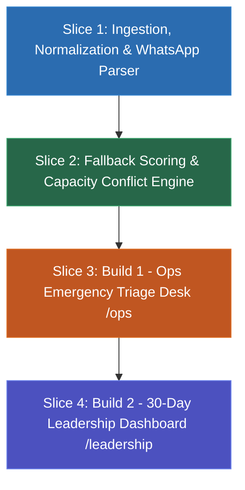

# Architecture & Implementation Plan: TiffinLoop MVP Vertical Slices
### Phase 2: Product & Architecture Staging (Plan-PRD)

Following [`docs/adr/0001-stack-and-architecture.md`](file:///c:/Users/user/Documents/antigravity/peaceful-brahmagupta/docs/adr/0001-stack-and-architecture.md) and the audit harness in [`.agents/reviews/0001-tiffinloop-audit-criteria.md`](file:///c:/Users/user/Documents/antigravity/peaceful-brahmagupta/.agents/reviews/0001-tiffinloop-audit-criteria.md), this plan decomposes the application into **4 testable vertical slices**.

---

## The 4 Vertical Slices

---

### Slice 1: Ingestion, Normalization & WhatsApp Dropout Detection Engine
* **Goal:** Parse `tiffinloop_seed/` in memory with zero file modification, normalize all dirty data (cities, phones, dates, statuses), detect all 3 dropouts (including Sunita Kulkarni from WhatsApp), and identify the duplicate Tariq Hussain record.
* **Files to create/modify:**
  - `src/lib/types.ts`: Canonical domain models (`Cook`, `Subscriber`, `Order`, `DropoutEvent`, `FallbackCandidate`, `TriageDecision`).
  - `src/lib/normalizers.ts`: Pure functions for city canonicalization (`BLR/Bangalore` $\to$ `Bengaluru`), phone sanitization, date parsing (`23/09/2026` vs `2026-09-23`), order status mapping, and subscriber deduplication.
  - `src/lib/data-loader.ts`: In-memory parser reading CSVs and `ops_whatsapp_export.txt`.
* **TDD Test Suite:**
  - `tests/unit/normalizers.test.ts`: Validates all city aliases, phone formats, and order statuses.
  - `tests/unit/data-loader.test.ts`: Validates parsing of 92 cooks, 532 subscribers, 7,138 orders, detection of Lakshmi (`CK086`), Geeta (`CK087`), and Sunita (`CK090`), and surfaces exactly 24 affected orders on 23-Sep-2026.

---

### Slice 2: Fallback Ranking & Capacity Conflict Engine
* **Goal:** Implement the mathematical candidate scoring algorithm ($w_{\text{cui}}=100, w_{\text{cap}}=40, w_{\text{rel}}=30$) and conflict split resolution.
* **Files to create/modify:**
  - `src/lib/fallback-engine.ts`:
    - Hard gating: Same city, active status, dietary compliance (especially Jain), non-zero capacity.
    - Capacity calculation: $\text{remaining\_capacity} = \text{max\_daily\_orders} - \text{active\_orders\_today}$.
    - Conflict Splitter: Automatically splits batches when a single backup cook cannot absorb all affected orders.
  - `src/app/api/triage/route.ts`: API route exposing triage data, dropout detection, and fallback recommendations.
* **TDD Test Suite:**
  - `tests/unit/fallback-engine.test.ts`: Validates candidate ranking, hard gating, Jain diet compliance, capacity enforcement, and multi-cook batch splitting.

---

### Slice 3: Build 1 — Ops Emergency Triage Desk UI (`/ops`)
* **Goal:** A clean, intuitive dashboard that enables an ops operator to triage all 24 disrupted orders in under 60 seconds with zero onboarding.
* **Components to create:**
  - `src/components/ops/EmergencyHeader.tsx`: 10:30 AM simulation clock, 12:30 PM lunch countdown (2 hours remaining!), active crisis metrics.
  - `src/components/ops/DropoutSelector.tsx`: Quick-select tabs for Lakshmi Iyer (9), Geeta Rao (9), and Sunita Kulkarni (6 with WhatsApp Alert badge).
  - `src/components/ops/AffectedOrdersTable.tsx`: Prioritizes Lunch orders over Dinner, displays subscriber details, dietary tags, and current assignment status.
  - `src/components/ops/FallbackPanel.tsx`: Displays top-ranked backup cooks with score badges, remaining capacity meters, 1-click batch reassign, and split reassignment options.
  - `src/components/ops/NotificationModal.tsx`: Real-time simulated WhatsApp/SMS notification preview (personalized messages; deduplicates Tariq Hussain).
  - `src/components/ops/AuditTimeline.tsx`: Traceability log tracking who was affected, what was decided, and when notifications were simulated.
  - `src/app/ops/page.tsx`: Full `/ops` triage page integrating all components with local storage persistence.

---

### Slice 4: Build 2 — 30-Day Leadership Reliability Dashboard (`/leadership`)
* **Goal:** A dedicated executive dashboard for leadership to spot systemic patterns across 30 days of historical orders.
* **Components to create:**
  - `src/lib/analytics.ts`: In-memory aggregator parsing 134 historical dropouts over 30 days.
  - `src/components/leadership/CityReliabilityChart.tsx`: Breakdown of dropouts by city (Bengaluru: 66, Pune: 49, Mumbai: 19).
  - `src/components/leadership/ChronicNoShowTable.tsx`: Highlights repeat offenders (e.g. Imran Agarwal `CK080` & Salman Sharma `CK062` in Pune with 20 dropouts each!).
  - `src/components/leadership/ExecutiveMetrics.tsx`: Revenue at risk, subscriber churn risk, and operational recommendations.
  - `src/app/leadership/page.tsx`: Clean one-page leadership view.

---

## Human Gate 1: Alignment & Approval
Before writing code for Slice 1:
- [ ] Confirm this vertical slice order aligns with your goals.
- [ ] Once approved, we will immediately write the failing tests for **Slice 1 (RED)** and implement the data engine to **GREEN**.
