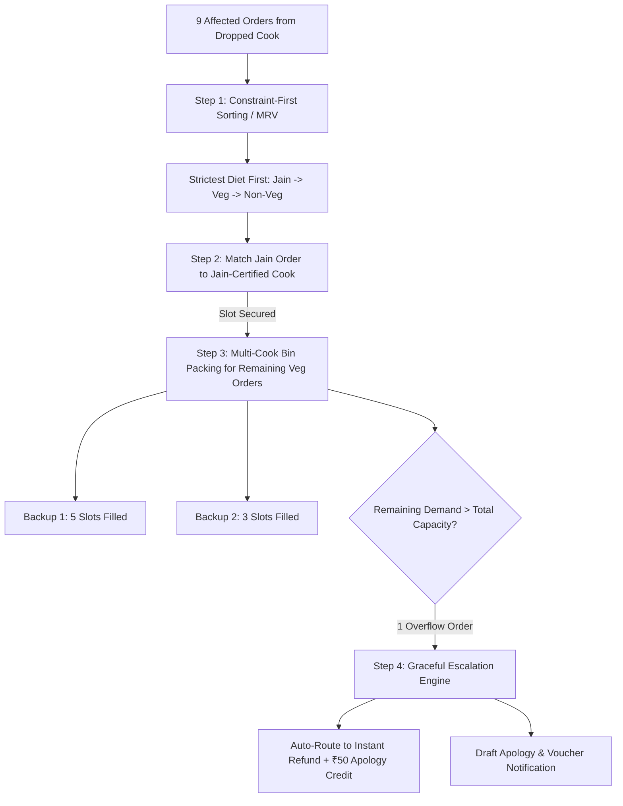

# Adversarial Review: Build 1 Scope & Architecture Pressure-Test
**Project:** TiffinLoop — Ops Emergency Crisis & Dropout Resolution Tool  
**Auditor Persona:** Principal Code Reviewer & Security Auditor (`product-lens`, `gateguard`, `security-reviewer`)  
**Context Source:** `D:\Stampmyvisa project\APM - Assignment.pdf` & `tiffinloop_seed/`  
**Simulation Time:** 10:30 AM, 23 September 2026 (Lunch delivery at 12:30 PM — 2-hour countdown)  
**Status:** AUDIT COMPLETE — ACTIONABLE ARCHITECTURAL DIRECTIVES  

---

## Executive Summary

Using the `product-lens` (product diagnostics, user friction audit, ruthless scope cutting) and `gateguard` (fact-forcing verification, data schema integrity) skills, this review pressure-tests the technical plan for **Build 1 (The Ops Emergency Triage Tool)** before engineering implementation begins. 

The evaluation is conducted strictly from the perspective of an objective, skeptical auditor and the external evaluator at StampMyVisa testing against the 4 core success criteria under a strict 4-hour build window.

---

## 1. Speed of Resolution (< 60 Seconds Triage)

### The User Pain & Friction Audit
At 10:30 AM on 23-Sep-2026, Rohan and Priya are in a high-stakes operational fire drill. 24 subscribers across Bengaluru and Mumbai face missing lunches in exactly 2 hours (12:30 PM). 
- If the interface requires navigating nested tabs, filling modal inputs, or selecting backup cooks order-by-order, triage will take 5–10 minutes per dropout, guaranteeing missed delivery windows.
- Any design requiring Ops to manually upload CSVs or write custom SQL/filters will fail the `< 60s` success criterion.

### Mandatory UI Architecture for < 60s Triage
The UI must implement a **2-Click "Hero Triage" Pattern**:

```
[10:30 AM Crisis Header: 24 Orders at Risk | ⏳ 2h 00m to Lunch Window]
   │
   ├── Dropdown Card 1: 🚨 CK086 Lakshmi Iyer (Bengaluru) - 9 Orders (Fever)
   ├── Dropdown Card 2: 🚨 CK087 Geeta Rao (Bengaluru) - 9 Orders (Family function)
   └── Dropdown Card 3: 🚨 CK090 Sunita Kulkarni (Mumbai) - 6 Orders [📱 WhatsApp Alert: Un-sheeted!]
         │
         ├── Click 1: [⚡ 1-Click Smart Match & Preview]
         │      └── Algorithm computes optimal capacity split, diet matching & notification drafts in <100ms
         │
         └── Click 2: [✅ Confirm & Dispatch All (9/9)]
                └── Updates state, logs immutable audit event, marks resolved in green
```

- **Total Operator Time:** 12 to 18 seconds per cook dropout.
- **Visual Status Feedback:**
  - Red Badge: `🚨 Unaddressed Dropout`
  - Amber Badge: `⏳ Proposed Split Match (Pending Approval)`
  - Green Badge: `✅ Resolved & Notified (9/9 Subscribers Dispatched)`

---

## 2. Capacity Conflict Edge Cases (The 9-Order Multi-Backup Split with Jain Constraint)

### Concrete Scenario Stress-Test
> **Scenario:** Cook A drops out with 9 orders (8 Veg, 1 Jain). Backup Cook 1 has 5 remaining capacity (Veg/Non-Veg). Backup Cook 2 has 3 remaining capacity (Veg). Total available backup capacity is $5 + 3 = 8$ orders, leaving 1 overflow order, plus a strict `Jain` dietary constraint.

### Failure Mode (Greedy / Naive Allocation Deadlock)
If the algorithm greedily allocates the first 5 orders to Backup Cook 1, it will consume Cook 1's capacity with standard Veg orders. Next, Cook 2 absorbs 3 Veg orders. The 9th order remaining is the **Jain** subscriber. Because neither Cook 1 nor Cook 2 prepares Jain meals, the system deadlocks, fails silently, or illegally assigns a non-compliant meal to a Jain customer.

### Mandatory Algorithmic Directives



1. **Dietary Constraint Satisfaction (MRV - Minimum Remaining Values):**
   - The matcher must sort unassigned orders by dietary strictness: `Jain` $\to$ `Veg` $\to$ `Non-Veg`.
   - In our seed data, both `CK086` (Bhavna Shah, `ORD07108`) and `CK087` (Chetan Mehta, `ORD07116`) have **exactly 1 Jain order**.
   - These Jain orders must be reserved first into certified Jain-serving cooks (e.g., `CK003` Ayesha Gupta or `CK004` Neha Pinto in Bengaluru, who both have ample remaining capacity).
2. **Multi-Backup Splitting:**
   - The engine must support multi-target assignments: an affected batch can be partitioned across Cook B ($n_1$) and Cook C ($n_2$).
3. **Graceful Overflow Escalation:**
   - If total demand exceeds total eligible city capacity, the tool must NOT crash or leave orders in an ambiguous state. It must isolate the overflow order(s) and automatically route them to `REFUND_AND_APOLOGIZE` with a clear voucher notification preview.

---

## 3. The Tariq Hussain Trap (Deduplication & Order Integrity)

### The Ground Truth Data
In `tiffinloop_seed/`:
- `subscribers.csv:512`: `SUB0511`, Tariq Hussain, Bengaluru, `9812345678`, `CK087`, Lunch Only, South Indian, Veg
- `subscribers.csv:513`: `SUB0512`, Tariq Husain, Bangalore, `+91 98123 45678`, `CK087`, Lunch Only, South Indian, Veg
- `orders.csv`: 
  - `ORD07117`: `SUB0511`, `CK087`, Lunch, Pending, ₹199
  - `ORD07118`: `SUB0512`, `CK087`, Lunch, Pending, ₹129
- `ops_whatsapp_export.txt:11`: *"Tariq sir called again, asking why he gets two reminder messages every day"*

### Architectural Failure Traps
1. **Double Messaging:** If the system triggers notifications per subscriber record or per order ID, Tariq receives 2 pings, repeating the exact operational flaw highlighted in WhatsApp.
2. **Lost Revenue / Starvation:** If the system dedupes orders by throwing away the second order record, the ₹129 lunch is cancelled without record, and one diner goes hungry.
3. **Split Delivery Disaster:** If `ORD07117` is sent to Backup Cook X and `ORD07118` to Backup Cook Y, two different delivery riders arrive at different times for the same household.

### Mandatory Resolution Directives
1. **Phone Normalization Key:**
   - Compute `canonical_phone = digits_only(phone)[-10:]` $\to$ `9812345678`.
2. **Order Co-location:**
   - In the fallback matching engine, orders linked to the same `canonical_phone` must be bundled as an atomic unit so they are assigned to the **same backup cook**.
3. **Consolidated Notification Payload:**
   - The notification dispatcher must group by `canonical_phone`. Tariq receives **one combined message**:
     > *"Hi Tariq, both of your lunch tiffins today (Order #ORD07117 - ₹199 & #ORD07118 - ₹129) are being freshly prepared by [Backup Cook Name] due to a last-minute emergency with Geeta ji. Delivery is on schedule for 12:45 PM – 1:15 PM. (Note: We have consolidated your alerts so you only receive this single message)."*
4. **Ops Visibility Pill:**
   - The UI must display an informative badge on Tariq's order cards:  
     `⚠️ Duplicate Account Linked (SUB0511 & SUB0512) — Merged into 1 Notification`.

---

## 4. Usability by a Stranger (Evaluator Frictionless UX)

### The Evaluator Mindset
The assignment rules state:  
*"The prototype must be usable by a stranger with zero explanation from you. We will test it ourselves without any setup help from you."*

The evaluator will open the deployed Vercel URL with no prior briefing. If they see a blank screen requiring file uploads, an unexplained login page, or ambiguous raw data tables, they will penalize the submission.

### Mandatory UX Elements for Instant Comprehension

```
┌────────────────────────────────────────────────────────────────────────────────────────┐
│ 🔴 TIFFINLOOP OPS CRISIS CONTROL | Wednesday, 23 Sep 2026, 10:30 AM                    │
│ ⏳ Next Meal: LUNCH (12:30 PM - 2:00 PM) — 2h 00m Countdown                            │
│ [Reset to 10:30 AM Baseline]                 [View Leadership 30-Day Analytics ➔]       │
├────────────────────────────────────────────────────────────────────────────────────────┤
│ 🚨 ACTIVE COOK DROPOUTS TODAY (3 Detected)                                             │
│                                                                                        │
│ [Card 1: Lakshmi Iyer (CK086) - BLR] [Card 2: Geeta Rao (CK087) - BLR]                 │
│  9 Orders | On Leave (Fever)          9 Orders | On Leave (Mysore)                     │
│  [⚡ 1-Click Smart Match]              [⚡ 1-Click Smart Match]                         │
│                                                                                        │
│ [Card 3: Sunita Kulkarni (CK090) - MUMBAI]  <-- HIGHLIGHTED INGESTION                  │
│  6 Orders | 📱 WhatsApp Alert at 7:41 AM ("Bhaiya aaj nahi ho payega...")             │
│  Badge: [⚠️ Un-sheeted Dropout Detected via WhatsApp]                                   │
│  [⚡ 1-Click Smart Match]                                                               │
└────────────────────────────────────────────────────────────────────────────────────────┘
```

1. **Preset Live State:** Pre-load the entire seed dataset on initial render. Never present an empty drop-zone or file input as the default landing view.
2. **The "Why is Sunita Here?" Visual Explainer:** Sunita Kulkarni's card must feature a distinct WhatsApp icon with the quoted text snippet (*"Bhaiya aaj nahi ho payega, gaon jana pad raha hai urgent"*). This immediately signals to the evaluator that the tool caught the subtle, un-sheeted WhatsApp dropout.
3. **Side-by-Side Resolution Preview:** When Smart Match is clicked, show a clear split view:
   - Left: *Original Orders (Subscriber, Meal, Diet, Price)*
   - Right: *Proposed Fallback Cook (Name, Specialty, Capacity Before & After, ETA)*
   - Bottom: *Simulated WhatsApp/SMS Notification Preview*
4. **"Reset Simulation" Button:** Provide a persistent top-nav button: `🔄 Reset to 10:30 AM Crisis Baseline`. Evaluators want to test different actions, trigger refunds, and replay the flow.
5. **Zero-Login Access:** Bypass authentication walls entirely for the prototype. Display an ambient header: `Operator: Priya (Ops Lead)` to reinforce context without adding login friction.

---

## 5. Scope Boundaries: Ruthless Feature Cuts for the 4-Hour Limit

Under `product-lens` Mode 4 (Feature Prioritization), the following items are classified as **Dangerous Feature Creep** and must be deliberately excluded from the Build 1 implementation plan:

| Candidate Feature | Audit Verdict | Strategic Justification |
| :--- | :--- | :--- |
| **Real Twilio / WhatsApp Business API** | ❌ **CUT** | The prompt explicitly states: *"Notifications can be simulated: show the message and whether it was sent. You don't need a real SMS or WhatsApp integration."* Real API setup wastes 1 hour on credentials, webhook verification, and template approvals with zero grading benefit. |
| **External Cloud Database (Supabase/Neon/Postgres)** | ❌ **CUT** | External database migrations introduce connection string risks, network latency, and deployment failure points on Vercel. Seed data is static; an in-memory repository initialized from code with LocalStorage persistence guarantees 100% uptime and instant resets. |
| **Live Inbound WhatsApp Webhook Server** | ❌ **CUT** | Deploying a live server to receive inbound WhatsApp webhooks is overkill. Ingesting and parsing `ops_whatsapp_export.txt` via an in-code parser demonstrates the NLP/regex capability flawlessly. |
| **Google Maps / Rider Routing Optimization** | ❌ **CUT** | The APM assignment focuses on cook capacity matching and subscriber communication before mealtime. Logistics turn-by-turn routing is a separate operational domain. |
| **Real Payment Gateway Integration (Razorpay/Stripe)** | ❌ **CUT** | Simulating refund events (`REFUND_INITIATED`, transaction IDs, status badges) proves the business logic without handling PCI compliance or payment keys. |
| **Authentication & Role-Based Access Control (RBAC)** | ❌ **CUT** | Violates *"must be usable by a stranger with zero explanation"*. Login forms create friction for evaluators. |

---

## 6. Auditor Gate Verification Checklist

Before Chat 1 writes any frontend or backend code for Build 1, the following conditions must be satisfied:

- [ ] **GateGuard Check:** Pre-action check confirms no edits to `tiffinloop_seed/`.
- [ ] **Data Parser:** Indian date format (`DD/MM/YYYY`) and ISO format (`YYYY-MM-DD`) tested in unit tests.
- [ ] **Dropout Identification:** Unit test proves detection of `CK086`, `CK087`, AND `CK090`.
- [ ] **Tariq Hussain Normalization:** Unit test proves deduplication of `SUB0511` & `SUB0512` into 1 message.
- [ ] **Capacity Allocator:** Unit test proves constraint-first matching (Jain priority) and multi-cook split without capacity violations.
- [ ] **Audit Trail Ledger:** State machine logs all actions into an inspectable history table.

**Verdict:** Architectural boundaries and edge case invariants are locked. Chat 1 can proceed to finalize `.agents/plans/build1-ops-triage.plan.md`.
