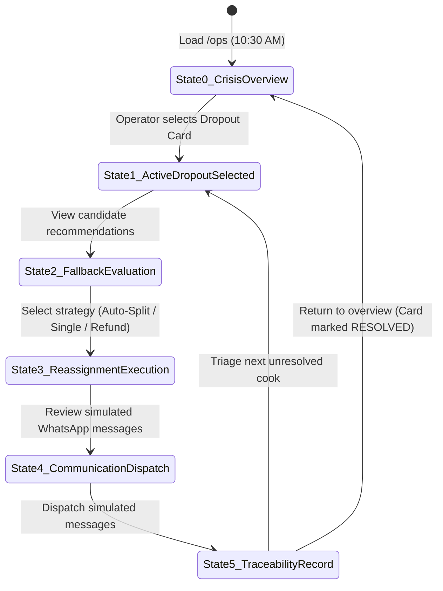

# Build 1 UI State Machine & Operator User Journey

**Project:** TiffinLoop Ops Crisis & Dropout Resolution  
**Author:** Lead Researcher & Systems Architect  
**Methodology:** `contract-first` (ECC Framework)  
**Date:** 2026-09-26  
**Simulation Anchor Time:** 10:30 AM, 23 September 2026  
**Target View:** `/ops` (Emergency Triage Desk)  
**Status:** Approved for Implementation by Chat 1 (The Builder)  

---

## 1. Executive Summary & Philosophy

The `/ops` view is an **emergency crisis response desk**. At **10:30 AM on 23-Sep-2026**, operations personnel have exactly **120 minutes** before the lunch delivery window opens (12:30 PM). 

### Design Principles for the Ops Desk:
1. **Zero-Onboarding Clarity:** A new ops coordinator must understand the current crisis and resolve it in under **60 seconds** without reading a manual.
2. **Deterministic Confidence:** Never require an operator to manually compute capacities or check whether a cook serves Jain food; the engine strictly gates and ranks options mathematically.
3. **Transparent Traceability:** Every click, split, and simulated notification produces a persistent, immutable audit event.

---

## 2. High-Level State Transition Diagram

---

## 3. Step-by-Step Operator Journey

### State 0: Crisis Overview (The 10:30 AM Command Center)

#### Visual Layout:
- **Top Sticky Banner:**
  - `Simulation Clock: 10:30 AM, 23-Sep-2026`
  - `🚨 Lunch Countdown: 01h 59m 45s (Window: 12:30 PM – 2:00 PM)`
  - `Dinner Countdown: 08h 59m 45s (Window: 7:30 PM – 9:00 PM)`
- **Crisis Metrics Bar (4 KPI Tiles):**
  1. **Dropped Out Cooks:** `3` (2 from sheet, 1 from WhatsApp alert)
  2. **Disrupted Orders:** `24` (`14 Lunch` / `10 Dinner`)
  3. **Revenue at Risk:** `₹3,466`
  4. **Entity Anomalies:** `1 Duplicate Subscriber Alert` (Tariq Hussain)
- **Dropout Queue (3 Interactive Cards):**
  - **Card 1: Lakshmi Iyer (`CK086`)**
    - *City:* Bengaluru | *Cuisine:* South Indian
    - *Disruption:* 9 orders (5 Lunch, 4 Dinner; 1 Jain)
    - *Source:* `Sheet (on_leave)` | *Status:* `UNRESOLVED` (Red pulse)
  - **Card 2: Geeta Rao (`CK087`)**
    - *City:* Bengaluru | *Cuisine:* South Indian
    - *Disruption:* 9 orders (5 Lunch, 4 Dinner; 1 Jain)
    - *Source:* `Sheet (on_leave)` | *Status:* `UNRESOLVED` (Red pulse)
    - *Badge:* ⚠️ `Duplicate Subscriber Attached (Tariq Hussain)`
  - **Card 3: Sunita Kulkarni (`CK090`)**
    - *City:* Mumbai | *Cuisine:* Maharashtrian
    - *Disruption:* 6 orders (4 Lunch, 2 Dinner; all Veg)
    - *Source:* `WhatsApp Alert (7:41 AM)` — **Not updated in sheet!**
    - *Status:* `UNRESOLVED` (Amber pulse)

---

### State 1: Active Dropout Selected (Impact Triage)

When the operator clicks on a dropout card (e.g. `CK086` Lakshmi Iyer):
- The card expands into the **Active Triage Workbench**.
- **Tabs:**
  - `Lunch Orders (5 Orders) — URGENT (12:30 PM)`
  - `Dinner Orders (4 Orders) — (7:30 PM)`
- **Order Roster Table:**
  - Columns: Order ID, Subscriber, Phone, Meal, Diet, Cuisine Pref, Amount, Action Status.
  - **Visual Badges:**
    - `Veg` orders render with a green pill.
    - `Jain` orders render with an **amber high-contrast warning badge**: `⚠️ JAIN — Strict Exclusion of Root Vegetables`.
    - `ORD07117` & `ORD07118` render with a **blue linking badge**: `🔗 Duplicate Subscriber: Tariq Hussain`.

---

### State 2: Fallback Evaluation (The Smart Matching Engine)

Adjacent to the order roster, the **Fallback Candidate Panel** renders the top 3 replacement kitchens scored by the algorithm:

#### Candidate Card Example (Bengaluru):
1. **Meena Nair (`CK088`) — Rank 1 (Score: 156.7 / 170)**
   - *Specialty:* South Indian (Exact Match ⭐)
   - *Capacity Meter:* `[========....] 8 remaining (Max 12 | Active 4)`
   - *Dietary Compatibility:* `Veg, Non-Veg`
   - *Alert Box:* 🛑 **Cannot serve Jain subscribers.** (Bhavna Shah must be rerouted).
   - *Action:* `Assign 8 Veg Orders`
2. **Neha Patel (`CK061`) — Rank 2 (Diet Specialist)**
   - *Specialty:* Maharashtrian (Regional Affinity)
   - *Capacity Meter:* `[=======.....] 13 remaining (Max 20 | Active 7)`
   - *Dietary Compatibility:* `Veg, Jain` ✅ **Jain Certified**
   - *Action:* `Assign Jain Order (Bhavna Shah)`
3. **Nadia Fernandes (`CK040`) — Rank 3 (High Capacity)**
   - *Specialty:* Gujarati (Surplus Capacity)
   - *Capacity Meter:* `[===.........] 22 remaining (Max 25 | Active 3)`
   - *Dietary Compatibility:* `Veg, Jain` ✅ **Jain Certified**

---

### State 3: Reassignment Execution (Conflict Resolution)

The operator is presented with three actionable execution buttons:

1. **Button A: "Smart Auto-Split (Recommended)"**
   - *One-Click Deterministic Resolution:*
     - Routes `ORD07108` (Bhavna Shah, Jain) $\rightarrow$ `CK061` (Neha Patel).
     - Assigns remaining 4 Lunch Veg orders $\rightarrow$ `CK088` (Meena Nair).
     - Queues 4 Dinner Veg orders for secondary allocation.
   - Shows live updated capacity meters preview.
2. **Button B: "Manual Custom Allocation"**
   - Allows operator to adjust assignments per row via dropdown selector.
3. **Button C: "Escalate to Instant Refund"**
   - Available per row or for entire remaining batch.
   - Triggers full order price refund + ₹50 goodwill wallet credit.

---

### State 4: Communication Dispatch (Simulated WhatsApp Preview)

Clicking "Proceed to Dispatch" opens the **Simulated Subscriber Communication Modal**:

#### Modal Features:
- **Live WhatsApp Chat Previews:** Renders exact WhatsApp speech bubbles with timestamps, emojis, and subscriber names.
- **Deduplication Safeguard Notice:**
  > 🛡️ **Duplicate Notification Suppressed:** Subscriber `SUB0512` (Tariq Husain) shares phone `+91 98123 45678` with `SUB0511`. Only **one unified message** will be sent.
- **Bulk Dispatch Controls:**
  - `[ Send All 9 Simulated WhatsApp Messages ]`
  - Individual message override toggle (`Simulate Delivery Failure` test button for edge cases).

---

### State 5: Traceability Record (Audit Persistence)

Upon confirming dispatch:
1. The modal closes with an animated success banner: `"Crisis Resolved for Lakshmi Iyer (9 Orders Processed in 42s)"`.
2. The card status flips from `UNRESOLVED` to `RESOLVED` (Green checkmark).
3. The remaining active dropout counter drops from 3 to 2.
4. An immutable audit record is immediately appended to the **Ops Audit Trail Table** at the bottom of the page:

| Timestamp | Event Type | Target | Operator | Action Summary |
| :--- | :--- | :--- | :--- | :--- |
| `10:32:15 AM` | `REASSIGN_BATCH` | `CK086` | Priya (Ops Desk) | 4 Veg orders assigned to CK088 (Meena Nair). |
| `10:32:15 AM` | `DIET_ROUTING` | `ORD07108` | Priya (Ops Desk) | Routed Jain order to CK061 (Neha Patel). |
| `10:32:18 AM` | `NOTIF_DISPATCH` | `9 Subs` | System | 9 Simulated WhatsApp messages sent (1 duplicate suppressed). |

---

## 4. Key Edge Cases Handled in UI

| Edge Case | UI Behavior & Safeguard |
| :--- | :--- |
| **Operator tries to assign a Jain order to Meena Nair (`CK088`)** | Dropdown option is **disabled** with tooltip: *"Violation: Cook does not prepare Jain food."* |
| **Cook capacity drops to 0 during multi-split** | Candidate card immediately displays badge `MAX CAPACITY REACHED` and disables further order allocation. |
| **Unrecorded WhatsApp Dropout (`CK090`)** | Displayed with prominent `WHATSAPP DETECTED (7:41 AM)` badge and 1-click button: *"Sync to Sheet"*. |
| **Duplicate Subscriber (Tariq Hussain `SUB0511`/`SUB0512`)** | Visual linking bar connecting both orders. Consolidated notification preview with double-billing alert. |
| **All backup cooks in city exhausted** | Automatic prompt: *"City capacity exhausted. Escalate remaining orders to Instant 100% Refund + ₹50 goodwill credit?"* |
