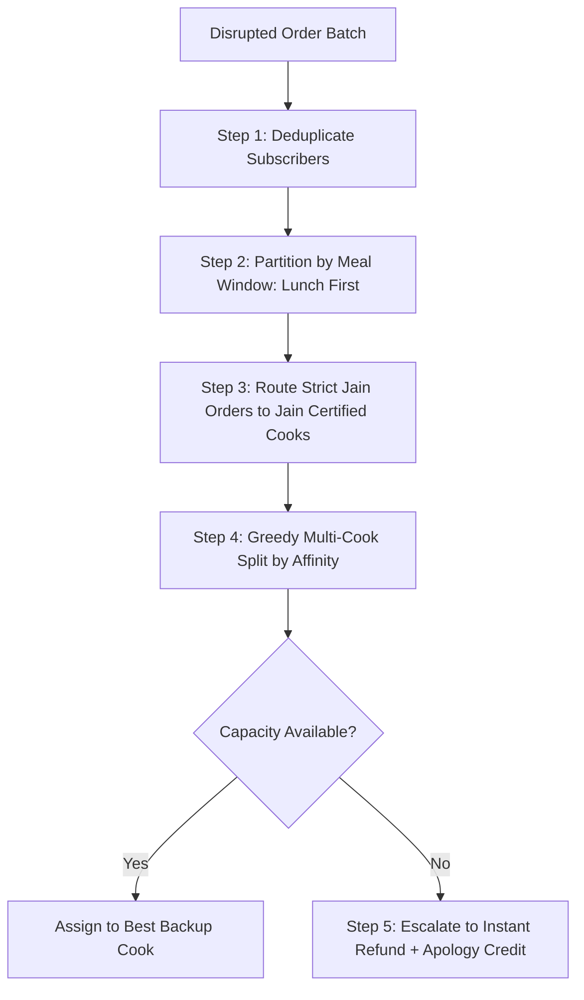

# Research Document 0002: Fallback Matching & Conflict Resolution Algorithm

**Project:** TiffinLoop Ops Crisis & Dropout Resolution  
**Author:** Lead Researcher & Systems Architect  
**Date:** 2026-09-26  
**Simulation Anchor Time:** 10:30 AM, 23 September 2026  
**Status:** Approved for Implementation by Chat 1 (The Builder)  

---

## 1. Problem Statement & Crisis Anatomy

At **10:30 AM on 23-Sep-2026**, operations must resolve 24 disrupted orders resulting from 3 cook dropouts:
- **`CK086` (Lakshmi Iyer, Bengaluru):** 9 orders (5 Lunch, 4 Dinner) — South Indian
- **`CK087` (Geeta Rao, Bengaluru):** 9 orders (5 Lunch, 4 Dinner) — South Indian
- **`CK090` (Sunita Kulkarni, Mumbai):** 6 orders (4 Lunch, 2 Dinner) — Maharashtrian

### The Time Horizon Asymmetry
1. **Lunch Window (12:30 PM – 2:00 PM):** Exactly **2 hours** remain. Food preparation must begin immediately. 14 lunch orders are at risk.
2. **Dinner Window (7:30 PM – 9:00 PM):** **9 hours** remain. Buffer allows broader chef coordination and prep flexibility. 10 dinner orders are at risk.

---

## 2. Mathematical Definition of Cook Capacity

For any cook $C \in \mathcal{C}$ on operational date $D$:

$$\text{active\_orders}(C, D) = \sum_{O \in \mathcal{O}(D)} \mathbb{I}\Big(\text{cook\_id}(O) = C \;\land\; \text{status}(O) \in \{\text{PENDING}, \text{IN\_PROGRESS}\}\Big)$$

The **Remaining Daily Capacity** $\mathcal{R}(C, D)$ is:

$$\mathcal{R}(C, D) = \max\Big(0, \;\text{max\_daily\_orders}(C) - \text{active\_orders}(C, D)\Big)$$

### Hard Gating Rules (Pruning Invariant)
A candidate cook $C$ is **immediately disqualified** for an order $O$ of subscriber $S$ if:
1. $\text{normalizeCity}(\text{city}(C)) \neq \text{normalizeCity}(\text{city}(S))$ *(Cross-city delivery is geographically impossible).*
2. $\text{status}(C) \neq \text{'active'} \;\lor\; \text{isDropoutToday}(C) = \text{true}$.
3. $\mathcal{R}(C, D) \le 0$ *(Cook is at or over maximum daily quota).*
4. $\text{subscriberDiet}(S) \notin \text{serves}(C)$ *(Dietary violation — especially Jain).*

---

## 3. Fallback Ranking & Scoring Formulation

For any candidate backup cook $C$ that passes all hard gating rules for order $O$ (subscriber $S$):

$$\text{FinalScore}(C, O) = w_{\text{cui}} \cdot \mathcal{S}_{\text{cuisine}}(C, S) + w_{\text{cap}} \cdot \mathcal{S}_{\text{capacity}}(C) + w_{\text{rel}} \cdot \mathcal{S}_{\text{reliability}}(C)$$

Where weights are calibrated to prioritize culinary satisfaction first, operational safety second, and cook reliability third:
- $w_{\text{cui}} = 100$
- $w_{\text{cap}} = 40$
- $w_{\text{rel}} = 30$

### 3.1 Cuisine Compatibility Score: $\mathcal{S}_{\text{cuisine}}(C, S) \in [0.1, 1.0]$
```
                  ┌── 1.0  (Exact Match: Cook Cuisine == Subscriber Preference)
                  │
S_cuisine(C, S) = ├── 0.4  (Compatible Regional Cluster: e.g., North Indian <-> Punjabi,
                  │                                     Maharashtrian <-> Gujarati)
                  └── 0.1  (Cross-Regional Neutral Fallback)
```

| Subscriber Preferred Cuisine | Compatible Regional Cluster ($\mathcal{S} = 0.4$) | Neutral Fallback ($\mathcal{S} = 0.1$) |
| :--- | :--- | :--- |
| **South Indian** | Maharashtrian | North Indian, Punjabi, Gujarati, Bengali, Continental |
| **Maharashtrian** | Gujarati, South Indian | North Indian, Punjabi, Bengali, Continental |
| **North Indian** | Punjabi, Bengali | Gujarati, Maharashtrian, South Indian, Continental |
| **Punjabi** | North Indian | Gujarati, Maharashtrian, South Indian, Bengali, Continental |
| **Gujarati** | Maharashtrian, North Indian | South Indian, Bengali, Continental |
| **Bengali** | North Indian | Punjabi, Gujarati, South Indian, Continental |
| **Continental** | North Indian | All regional Indian cuisines |

### 3.2 Capacity Buffer Score: $\mathcal{S}_{\text{capacity}}(C) \in (0.0, 1.0]$
Cooks with more head-room handle sudden emergency additions with lower error rates:

$$\mathcal{S}_{\text{capacity}}(C) = \frac{\mathcal{R}(C, D)}{\text{max\_daily\_orders}(C)}$$

### 3.3 Reliability Score: $\mathcal{S}_{\text{reliability}}(C) \in [0.0, 1.0]$
Penalizes home cooks with a chronic track record of unannounced no-shows:

$$\mathcal{S}_{\text{reliability}}(C) = \max\left(0.0, \; 1.0 - \frac{\text{historical\_dropouts}(C)}{10}\right)$$

*Example:* `CK080` (Imran Agarwal) and `CK062` (Salman Sharma) each have **20 historical dropouts** $\implies \mathcal{S}_{\text{reliability}} = 0.0$. A cook with zero dropouts receives $\mathcal{S}_{\text{reliability}} = 1.0$.

---

## 4. Conflict Analysis: The Bengaluru Capacity Crunch

### 4.1 The Impasse
On 23-Sep-2026, Bengaluru has **18 disrupted orders** across `CK086` (Lakshmi Iyer) and `CK087` (Geeta Rao). Both cooks specialize in **South Indian**.

Inspecting all active cooks in Bengaluru:
- There is only **one other South Indian cook** in the entire Bengaluru network:
  **`CK088` (Meena Nair)**:
  - `max_daily_orders` = $12$
  - `active_orders_today` = $4$
  - **`remaining_capacity`** = $12 - 4 = \mathbf{8}$
  - `serves` = `Veg, Non-Veg` **(Does NOT serve Jain!)**

### 4.2 The Double Conflict
1. **Capacity Deficit:** Meena Nair has only **8 available slots**, but there are **18 disrupted orders** (10 Lunch, 8 Dinner).
2. **Strict Jain Dietary Violation:** Two subscribers require strict **Jain** preparation:
   - `ORD07108` (Bhavna Shah, `SUB0502`, Lunch): Jain
   - `ORD07116` (Chetan Mehta, `SUB0510`, Dinner): Jain
   - Assigning either order to Meena Nair violates dietary rules.

---

## 5. Intelligent Multi-Tier Conflict Resolution Protocol

To resolve capacity crunches deterministically without manual panic, the engine follows a 5-step triage pipeline:



### Step 1: Subscriber Deduplication
- Detect duplicate subscriber: `SUB0511` and `SUB0512` (Tariq Hussain).
- Merge into a single delivery notification.
- Reduce Bengaluru Lunch demand from 10 orders to **9 unique deliveries**.

### Step 2: Time-Horizon Priority Partitioning
- **Immediate Execution:** Resolve **Lunch orders first** (deadline in 2 hours).
- **Secondary Execution:** Queue **Dinner orders** for staged afternoon matching.

### Step 3: Strict Jain Order Segregation
- Filter Bengaluru cooks whose `serves` includes `Jain` and who have remaining capacity:
  - `CK020` (Ritu Chatterjee, Bengali): Remaining capacity = 38
  - `CK036` (Vikram Ahmed, Gujarati): Remaining capacity = 24
  - `CK040` (Nadia Fernandes, Gujarati): Remaining capacity = 22
  - `CK046` (Karan Fernandes, North Indian): Remaining capacity = 9
  - `CK061` (Neha Patel, Maharashtrian): Remaining capacity = 13
- **Resolution:**
  - Route `ORD07108` (Bhavna Shah, Lunch, Jain) $\rightarrow$ `CK061` (Neha Patel, Maharashtrian Veg/Jain) or `CK040` (Nadia Fernandes, Gujarati Veg/Jain).
  - Route `ORD07116` (Chetan Mehta, Dinner, Jain) $\rightarrow$ `CK040` (Nadia Fernandes).

### Step 4: Greedy Multi-Cook Split for Lunch Orders
After isolating Bhavna Shah's Jain order, **8 South Indian Veg Lunch orders** remain:
- `ORD07105` (Mahesh D'Souza)
- `ORD07106` (Alok Singh)
- `ORD07107` (Chetan Verma)
- `ORD07109` (Farah Gupta)
- `ORD07111` (Suresh Desai)
- `ORD07114` (Sanjay Sharma)
- `ORD07115` (Harish Sharma)
- `ORD07117` (Tariq Hussain)

**Allocation:**
- Exactly **8 slots** are available with **`CK088` (Meena Nair)**!
- Assign **all 8 Lunch Veg orders** to `CK088`.
- Meena Nair's remaining capacity drops to $8 - 8 = 0$.
- **Result:** 100% of Bengaluru Lunch subscribers receive a warm meal on time!

### Step 5: Dinner Order Strategy & Refund Escalation Policy
For the 8 remaining Dinner orders (due at 7:30 PM):
1. **Tier A Reassignment:** Meena Nair is at 0 capacity. The algorithm presents ops with the top alternative regional cooks in Bengaluru with high surplus capacity:
   - `CK014` (Zoya Patel, Maharashtrian, Remaining: 22)
   - `CK032` (Shweta Bose, North Indian, Remaining: 34)
   - `CK041` (Ritu Verma, North Indian, Remaining: 30)
2. **Tier B One-Click Refund Option:**
   - If an operator prefers not to cross cuisines for a South Indian subscriber, the system provides a **1-Click Escalate to Refund** action.
   - Instantly triggers simulated refund of the order amount (`amount_inr`) + a ₹50 goodwill wallet credit.

---

## 6. Mumbai Triage Resolution: Clean 1-to-1 Match

In Mumbai, 6 orders under `CK090` (Sunita Kulkarni) are disrupted:
- Cuisine: Maharashtrian
- Diet: All 6 subscribers are `Veg`
- 4 Lunch orders, 2 Dinner orders

### Candidate Evaluation in Mumbai
- **`CK091` (Rekha Patil):**
  - City: Mumbai
  - Cuisine Specialty: **Maharashtrian** (Exact Match $\mathcal{S}_{\text{cui}} = 1.0$)
  - Serves: `Veg, Non-Veg` (Compatible with `Veg`)
  - `max_daily_orders` = $30$, `active_today` = $5 \implies \mathcal{R} = \mathbf{25}$
  - Historical Dropouts: $0 \implies \mathcal{S}_{\text{rel}} = 1.0$
  - Score: **166.7 / 170.0** (Rank 1 by a wide margin)

**Resolution:** Reassign all 6 orders directly to `CK091` (Rekha Patil) in a single batch operation. Rekha's remaining capacity adjusts to $25 - 6 = 19$.

---

## 7. Concrete Handoff Schema for Chat 1 (The Builder)

```typescript
export interface FallbackRecommendation {
  orderId: string;
  subscriberId: string;
  subscriberName: string;
  mealType: 'Lunch' | 'Dinner';
  diet: 'Veg' | 'Jain' | 'Non-Veg';
  cuisinePref: string;
  amountInr: number;
  originalCookId: string;
  recommendedCook: {
    cookId: string;
    cookName: string;
    cuisineSpecialty: string;
    remainingCapacityBefore: number;
    remainingCapacityAfter: number;
    matchScore: number;
    isExactCuisineMatch: boolean;
    isDietCompliant: boolean;
  } | null;
  requiresRefundEscalation: boolean;
  conflictReason?: string;
}

export interface TriageExecutionPlan {
  totalOrders: number;
  resolvedOrders: number;
  refundOrders: number;
  deduplicatedSubscribers: number;
  allocations: FallbackRecommendation[];
}
```
